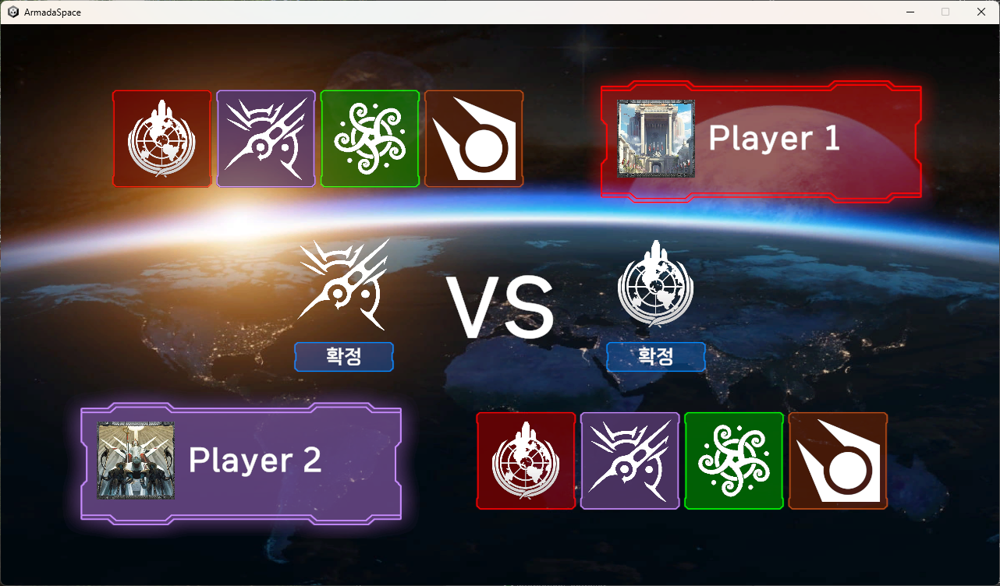
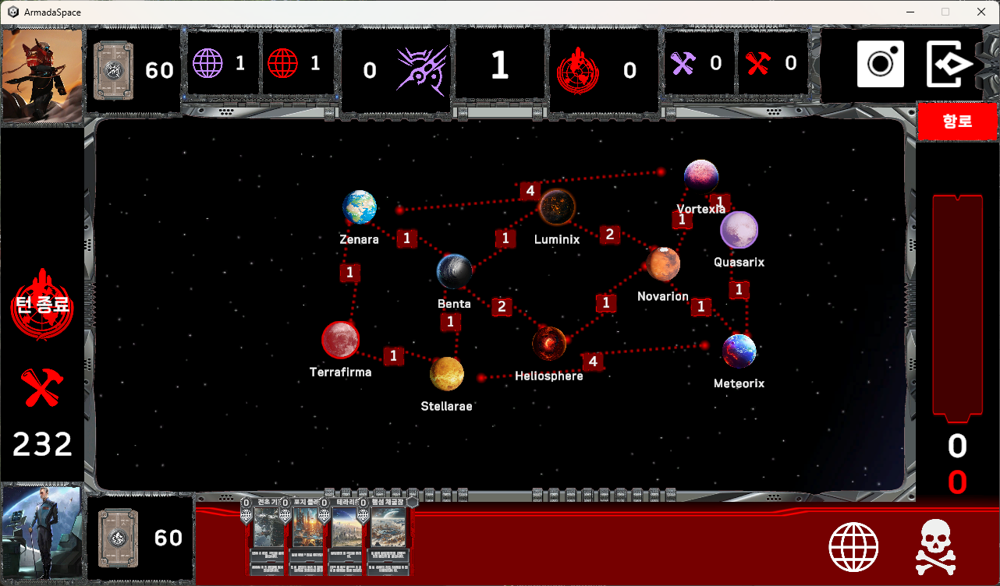
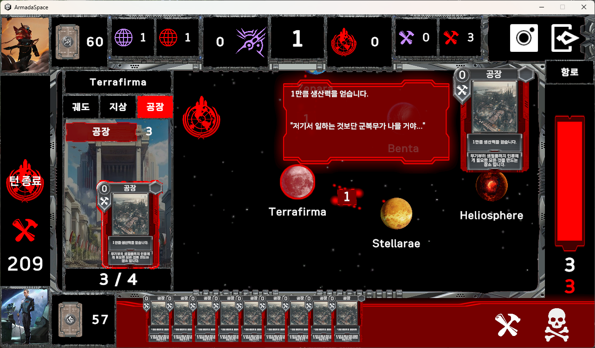
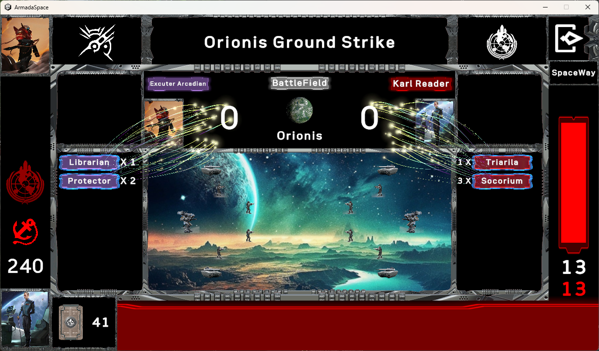

# ArmadaSpace
## 장르
- 2D SF 전략 TCG
## 게임 소개
<table>
  <tr>
    <td></td>
    <td></td>
  </tr>
  <tr>
    <td></td>
    <td></td>
  </tr>
</table>
- 전장의 각 거점(행성)에 주어진 덱의 유닛(카드)들을 배치하여 자원을 모으고 상대의 거점을 공격해 상대의 메인 거점(행성)을 차지하는 것이 목적인 턴제 전략 게임입니다.
## 소개 영상
(링크 삽입할 것)
## 개발 목적
- Unity UI/UX 구현 숙달
- 기획자와 기획서로 소통하며 협업
## 개발 환경
- Unity 2022.3.15f1
## 작업 기간
- 2024년 7월 ~ 2024년 10월
## 빌드
(링크 삽입할 것)
- WebGL(Firebase Hosting) https://armada-space-alpha.web.app/

## 사용 에셋
- TextMeshPro
- Sci-Fi Card Template Charlie
  
  카드 배경 이미지 리소스로 사용하였습니다.
- Particle Attractor by Moonflower Carnivore
  
  ParticleSystem이 적용된 전투 연출에 원본 스크립트를 편집하여 사용하였습니다.
- Unity UI Samples
  
  메뉴 UI에 사용하였습니다.
- All In 1 Sprite Shader
  
  카드 Outline, Fade Out 효과 등에 사용하였습니다.

## 주요 사용 기술

| 항목명        | 설명      |
| ------------- | ------------- |
| Design Pattern  | MVP Pattern, Singleton Pattern  |
| UI Object Binding  | 자식 컴포넌트 자동 바인딩  |
| Object Pooling  | 자주 사용하는 Object를 Stack 기반으로 풀링  |
| BFS  | 너비 우선 탐색 기반으로 항로 연결 여부 계산  |
| TaskSequencer  | UI 연출 순차 진행을 위해 사용  |
| ExcelToJsonConverter  | Editor 스크립트로 Excel 파일을 Json 파일로 자동 변환  |

